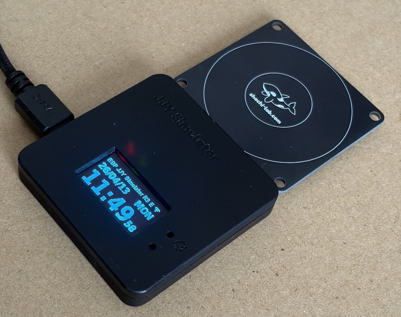
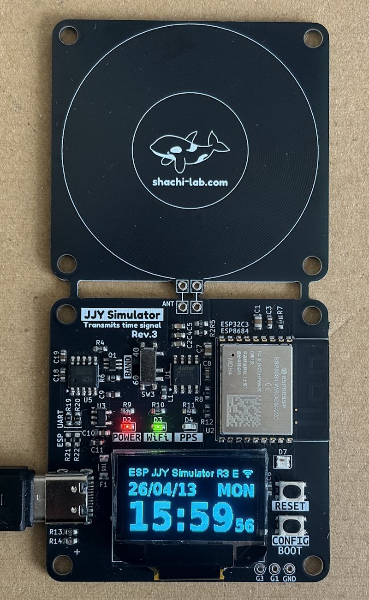
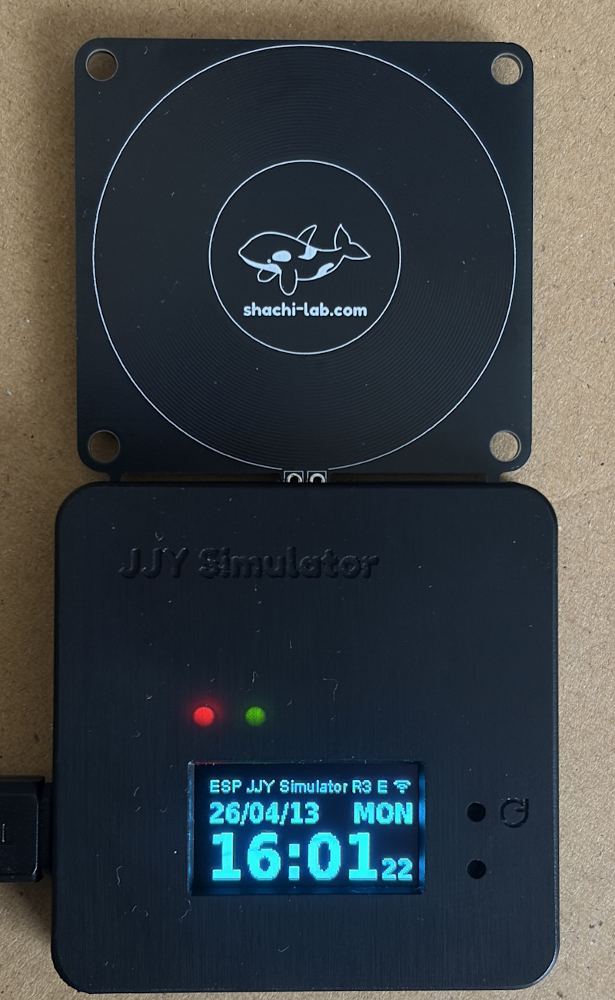

# 📡 JJY Simulator Rev.3 for ESP32-C3/ESP8684

電波時計の補正信号をESP32-C3/ESP8684で自作！  
NTPから取得した正確な時刻をもとに、40kHz / 60kHz のJJY信号をPWM出力で模倣する、  
ミニJJYシミュレーターです。  
Rev.3 は ESP-IDFで開発しました。

👉 [English README is available here](README.md)

---

## 🪛 特徴

* **ESP32-C3 / ESP8684** の両対応
* **ESP-IDF** による本格的な構成
* Wi-Fi設定はボタンひとつで **簡単APモード**
* **OLED 表示** による時刻・同期状態の確認 
* **NTP** で自動時刻同期
* **JJY 40kHz（東日本）/ 60kHz（西日本）** を切り替え可能
* **基板上のスイッチ** で出力BANDへの最適化が可能 
* 出力信号は基板内蔵の**簡易アンテナ** から放射
* **Hブリッジ構成** で高出力です（飛びすぎ注意）
* **Web ブラウザ** での設定ページ
* **タイムゾーン と、DST（夏時間）** に対応
* 動作中は**時計画面**を表示

<a href="./images/jjy-sim-r3.jpg">
</a><br/>

---

## 🛠 ビルドと書込み (ESP-IDF / CLI)

JJY-SIM R3 は、ESP-IDF を使用してビルド・書き込みを行います。  
R2ではArduinoベースでしたが、  
R3ではタイミング精度と構造改善のため、ESP-IDFに移行しています。  

> ### ⚠️ 注意
> * Arduino環境ではビルドできません
> * ESP-IDF専用プロジェクトです

### ■ 環境

* ESP-IDF v5.x
* Python（idf.py が動作する環境）

ESP-IDFのセットアップについては、公式ドキュメントを参照してください。

### ■ ビルド

プロジェクトディレクトリに移動して、以下を実行します。

```bash
idf.py build
```

### ■ 書き込み

```bash
idf.py flash
```

ポート指定が必要な場合：

```bash
idf.py -p COMx flash
```

### ■ シリアルモニタ

```bash
idf.py monitor
```

### ■ フルコマンド

```bash
idf.py -p COMx flash monitor
```

これひとつで、書き込みとログ確認ができます。

### ■ ターゲット設定

初回のみ、ターゲットを設定してください。  
使用するモジュールに応じて設定が必要です。

* ESP32-C3 を使用する場合：
```bash
idf.py set-target esp32c3
```

- ESP8684 を使用する場合：  
ESP8684 は ESP32-C2 ベースのモジュールのため、  
チップ選択では esp32c2 を指定します。
```bash
idf.py set-target esp32c2
```

---

## 🛠 ビルドと書込み (VSCode / GUI)

VSCode + ESP-IDF Extension を使用した開発も可能です。

### ■ 推奨拡張機能

* ESP-IDF Extension (Espressif)

VSCodeに拡張機能をインストールすることで、

* ビルド
* 書き込み
* シリアルモニタ

をGUIから操作できます。

### ■ セットアップ

ESP-IDF Extensionのセットアップに従って環境を構築してください。

拡張機能がインストールされていれば、

* `Build`
* `Flash`
* `Monitor`

などがワンクリックで実行できます。

### ■ ワークスペース  


VSCodeで開く場合は、ソースコードフォルダ内の  
**`jjy-sim-r3.code-workspace`** を開くことで、  
ESP-IDF Extension の設定を含めた状態で作業できます。

---

## ⚙️ 使用方法

### ■ Wi-Fi設定

* 電源投入 or リセット後、5秒以内に CONFIGスイッチを押す  
  初回起動時は無条件にWi-Fi設定状態となります
* `JJY-SIM-R3-XXXXXXXX` というAPが起動
* スマホやPCから接続 → キャプティブポータルが表示されます。
* SSID を選んで Password を設定します。
* 必要に応じて、BAND、ローカル時間、DST（夏時間）を設定可能です。 
* [保存して再起動] で、設定した内容を保存して再起動します。

### ■ 動作確認

* 電源投入 or リセット でロゴ表示後、5秒間放置すると、WiFiのAPに接続しに行きます。
* APに接続すると、NTPサーバーから時刻を取得します。
* OLEDに現在時刻が表示され、0秒からPWMでJJY信号出力開始
* 電波時計の「受信ボタン」を押して、近くに置いておくだけ！

### ■ 動作中の操作

画面が時計表示中の時は、以下の操作が可能です。
* [CONFIG]ボタンを1秒程度押すと、情報画面が表示されます。  
  再度、[CONFIG]ボタンを押すと、時計画面に戻ります。
* [CONFIG]ボタンを5秒以上長押しすると、JJYの送信出力を停止します。   
  再度、[CONFIG]ボタンを5秒以上長押しすると、JJYの送信出力を再開します。 

---

## 🔌 ピンアサイン（主なもの）

| 機能 | GPIO | 備考 |
|------|------|------|
| JJY PWM出力 | 10,4 | 変調された信号で、Hブリッジ用にA/Bの反転出力 |
| CONFIGスイッチ | 9 | Wi-Fi設定用（**BOOTピンと兼用**） |
| ACT LED | 5 | 動作中LED |
| IND LED | 0 | 状態表示用LED（共用可） |
| OLED Reset | 2 | OLEDモジュールリセット |
| OLED SDA|7| OLED I2C データー|
| OLED SCL |6|OLED I2C クロック|

---

## 🧾 ファイル構成

### 💻 ファームウェア

* ファームウェアのソースコードは、**`firmware/idf`** フォルダにあります。
* R2 で使用していた Arduino用のOLED ドライバライブラリを、自身でIDFのコンポーネントとしてポーティングして再構築したライブラリを使用しています。  
なお、このコンポーネントは、GitHubで公開しています。  
👉 [SSD1306 OLED display driver](https://github.com/Shachi-lab/oled_display)
* `storage_key.h` にはダミーの値が設定されていますがそのまま使用できます。  
  セキュリティを強化するため、ビルド前にこれらの値を独自の値に置き換えることをお勧めします。

### 🧰 ハードウェア

* ハードウェア設計データは、**`hardware`** フォルダ にあります。
* 回路図、基板設計データーは、**`hardware/KiCad`** フォルダにあります。 
  * **KiCad Ver.9** に対応しています（Ver.8以前では開けません）  
  * **ガーバーデータ** は **`KiCad/PLOT`** フォルダに含まれており、そのまま基板製作が可能です。
* ケースの3Dデーターは、**`hardware/case_3d`** にあります。

---

## 📸 外観・実装例

基板とケースの外観です。  
黒基板＋黒ケースでまとめて、表示だけが浮いて見えるようにしています。

<a href="./images/jjy-sim-r3_pcb.jpg">
</a>
<a href="./images/jjy-sim-r3_case.jpg">
</a><br/>

---

## ⚠️ ご注意

思った以上に電波が飛びます。  
電波法を守って実験してください。

---

## 🔗 関連リンク

* ブログ記事（詳細解説）  
  👉 https://blog.shachi-lab.com/054_jjy-sim-r3-esp8684-idf/
